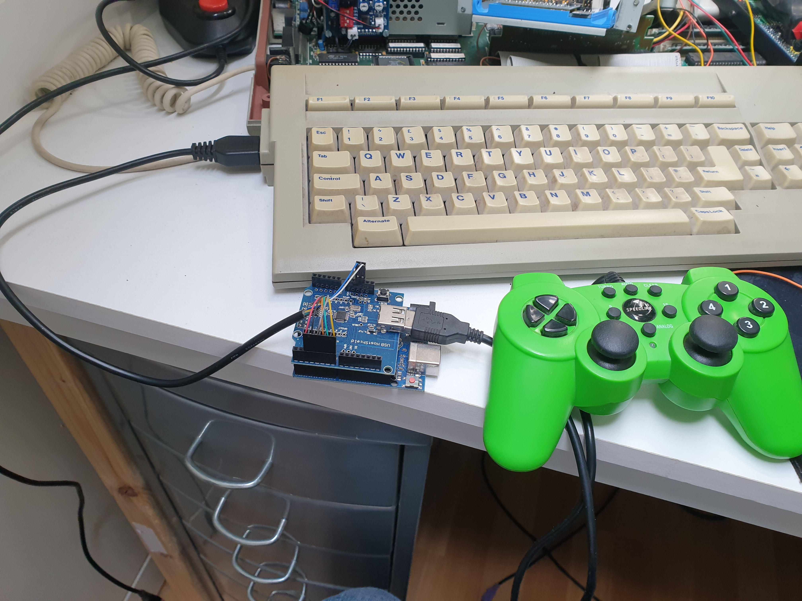
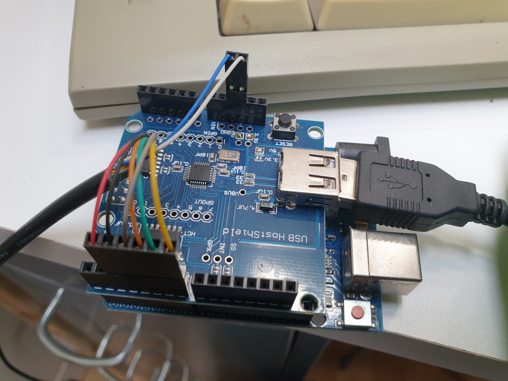

# USB gamepad on the AtariST
Use an Arduino Uno and a USBhostShield to connect a USB gamepad to a retro computer like Atari ST

# Needs
- an arduino uno board
- an arduino USBhost shield
- a piece of old fashioned 9 pin joystick wire with connector
- dupont female connectors

# Programming
- Place the three files hidjoystickrptparser.cpp, hidjoystickrptparser.h and USBHIDJoystick.ino in a projectmap into your Arduino project folder.
- Connect your PC with your arduino UNO board using a proper USB cable
- Open your Arduino IDE and open USBHIDJoystick.ino.
- Compile and upload the board
- See images for the right connections (Atari ST) OR find out your own setup.

# Connections
- UP on Arduino pin 2
- DOWN on Arduino pin 3
- LEFT on Arduino pin 4
- RICHT on Arduino pin 5
- FIRE 1 on Arduino pin 6
- FIRE 2 on Arduino pin 7
- 5V/VCC on Arduino 5v
- GROUND on Arduino GND
 
For connections on de Atari ST Joystick port see the [wiki](https://en.wikipedia.org/wiki/Atari_joystick_port)

GOOD LUCK!

